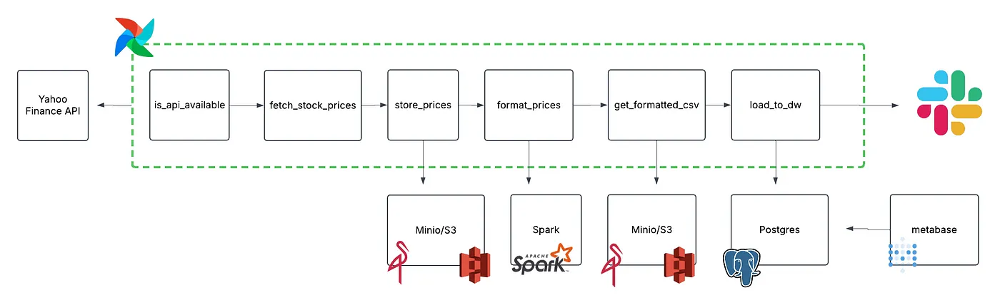
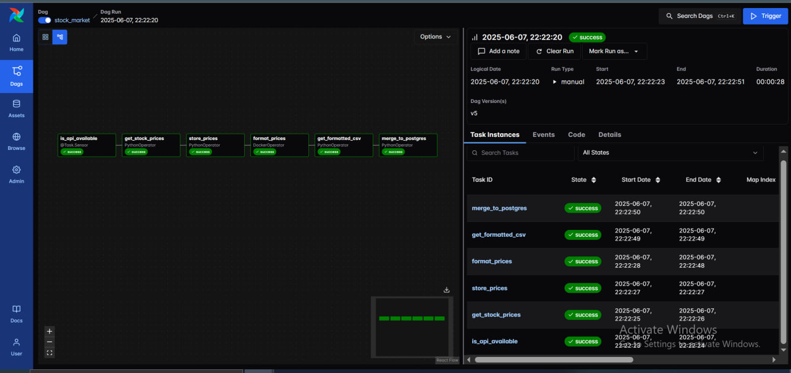
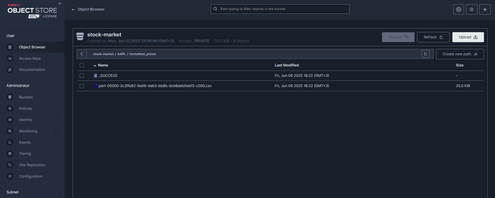
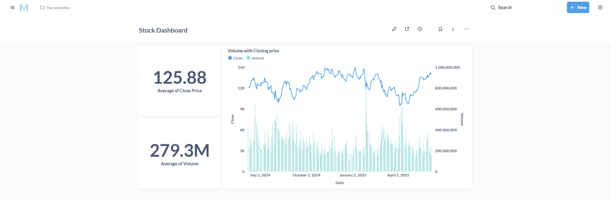

# Airflow Stock Market ETL Pipeline

A complete end‑to‑end data pipeline using Apache Airflow, Spark, MinIO (S3‑compatible object store), and PostgreSQL, all orchestrated locally with the Astronomer CLI (*Astro*).

---

## 📖 Overview

This project periodically fetches historical stock price data from the Yahoo Finance API, stores raw JSON in MinIO, formats it with Spark into CSV, and then merges only the new records into PostgreSQL. A Metabase dashboard can then visualize the loaded data.

<div align="center">

<em>Figure 1: High‑level pipeline architecture</em>
</div>

---

## 🧰 Prerequisites

1. **Docker & Docker Compose** installed and running.
2. **Git** (for cloning this repo).
3. **Astronomer CLI (Astro)** to spin up Airflow locally:

   ```bash
   # macOS via Homebrew:
   brew install astronomer/tap/astro-cli

   # Linux / Windows (via pip):
   pip install astro-cli

   # Verify installation:
   astro version
   ```
4. **MinIO Client (mc)** *optional* for inspecting bucket contents.

---

## 🛠️ Build Spark Images (before starting Astro)

Before using Astro, build these three Docker images manually:

```bash
# Spark Master
cd spark/master
docker build -t airflow/spark-master .

# Spark Worker
cd ../worker
docker build -t airflow/spark-worker .

# Spark Application Image (used by DockerOperator)
cd ../notebooks/stock_transform
docker build -t airflow/stock-app .
```

These images are referenced in `docker-compose.override.yml` and used in DAG execution.

---

## 🚀 Setup & Local Development

1. **Clone the repository**:

   ```bash
   git clone https://github.com/<your-org>/airflow-stock-market.git
   cd airflow-stock-market
   ```

2. **Start everything with Astro**:

   ```bash
   astro dev start --wait
   ```

   This will bring up:

   * Airflow webserver & scheduler (on [http://localhost:8080](http://localhost:8080))
   * MinIO (on [http://localhost:9000](http://localhost:9000))
   * Spark master & worker
   * PostgreSQL
   * Metabase (optional)

3. **Add Airflow connections** (via UI or `airflow_settings.yaml`):

   * **stock\_api**: *generic* pointing at Yahoo Finance endpoint + headers.
   * **minio**: *generic* (host: `minio:9000`, login: `minio`, password: `minio123`).
   * **postgres**: credentials are `postgres:postgres@postgres:5432/postgres`.

4. **Run a test DAG**:

   ```bash
   astro dev run dags test stock_market 2025-06-01
   ```

---

## 📂 Repo Structure

```
├── dags/                  # Airflow DAG definitions
│   └── stock_market.py
├── include/               # Custom task modules & helpers
│   └── stock_market/tasks.py
├── spark/                 # Spark application + Dockerfiles
├── airflow_settings.yaml  # Connections & variables
├── docker-compose.override.yml
├── requirements.txt
├── packages.txt           # System‑level packages
├── pg_hba.conf
├── tests/                 # Unit tests for DAGs
└── docs/                  # Screenshots and architecture diagrams
    ├── architecture.png             # <-- attach architecture diagram
    ├── minio_storage.png           # <-- attach screenshot of MinIO UI
    ├── airflow_dag.png             # <-- attach screenshot of DAG in Airflow
    └── metabase_dashboard.png      # <-- attach Metabase dashboard image
```

---

## 🔧 How It Works

1. **`is_api_available`** sensor: polls the Finance API until it’s ready.
2. **`get_stock_prices`**: fetches raw JSON and XComs the payload.
3. **`store_prices`**: pushes JSON to `s3://stock-market/<SYMBOL>/prices.json` in MinIO.
4. **`format_prices`** (DockerOperator + Spark): reads JSON from MinIO, explodes and zips arrays, writes CSV back under `formatted_prices/`.
5. **`get_formatted_csv`**: lists new CSV files and returns the path.
6. **`merge_to_postgres`**: downloads all CSVs into a staging table, then upserts only new records into the final `stock_market` table.

---

## 📑 Screenshots

<div align="center">

|              Architecture              |              Airflow DAG             |           MinIO Bucket           |            Metabase Dashboard            |
| :------------------------------------: | :----------------------------------: | :------------------------------: | :--------------------------------------: |
|  |  |  |  |

</div>

---

## 🛠️ Deployment

To push this project live (on Astronomer Cloud or your own Kubernetes cluster):

1. **Build & publish** the Spark Docker image:

   ```bash
   cd spark/notebooks/stock_transform
   docker build -t <your-registry>/stock-app:latest .
   docker push <your-registry>/stock-app:latest
   ```

2. **Update** the DAG’s `DockerOperator` image reference to your published tag.

3. **Deploy** the Airflow chart or Astronomer project as usual.

---

*Last updated: 2025‑06‑07*


